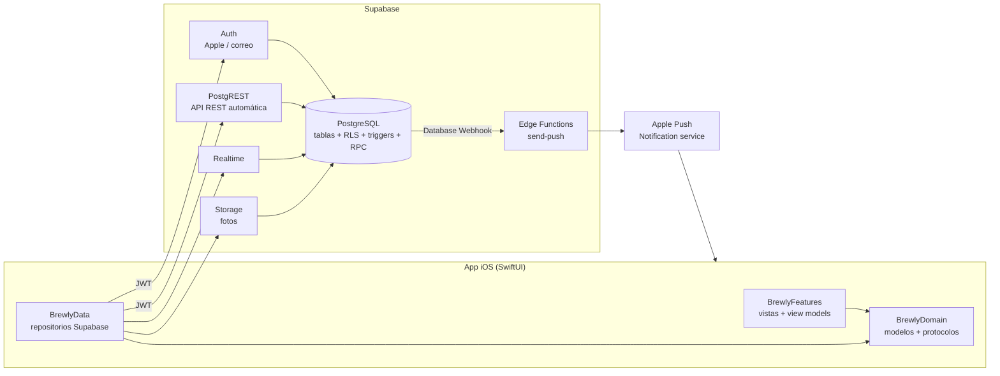
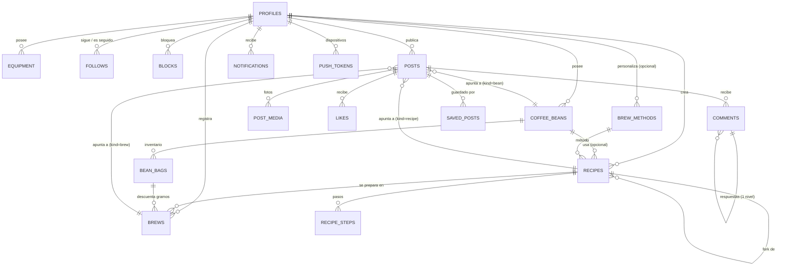
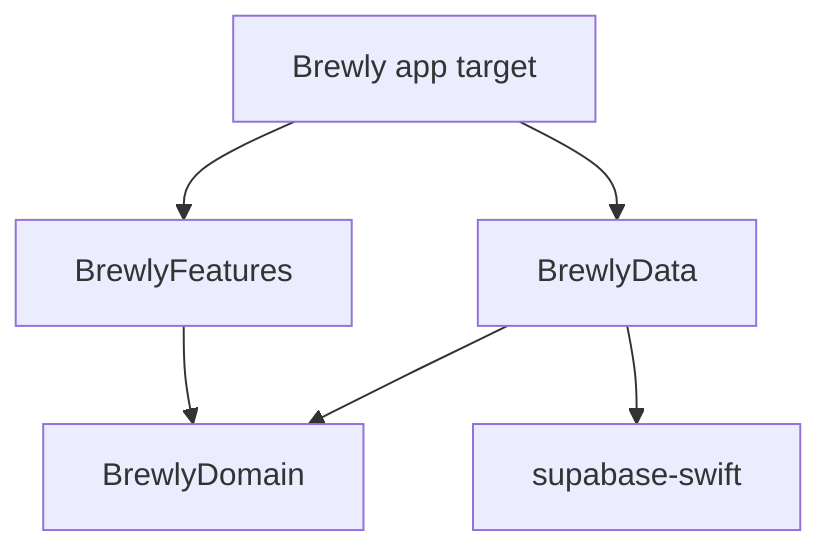
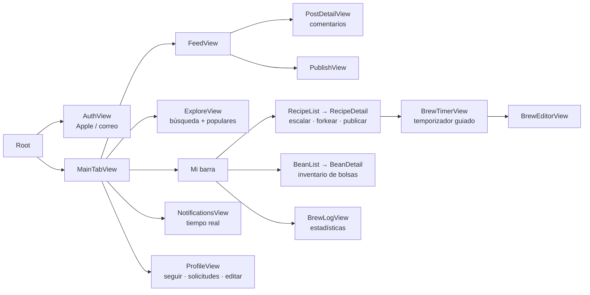

# Arquitectura de Brewly

Brewly es una app iOS para baristas con dos caras:

1. **Herramienta personal**: gestionar granos e inventario, equipo, métodos de preparación, recetas con pasos y temporizador guiado, y una bitácora de cada taza con su evaluación sensorial.
2. **Red social**: publicar recetas, preparaciones y cafés; seguir a otros baristas (con cuentas privadas), dar "me gusta", comentar, guardar y copiar ("forkear") recetas.

La regla de diseño central es que **todo lo personal nace privado** y solo se comparte cuando el usuario lo decide explícitamente.

---

## 1. Visión general y decisiones



| Decisión | Elección | Motivo |
|---|---|---|
| Backend | **Supabase** (PostgreSQL gestionado) | Los datos son muy relacionales (usuarios ↔ seguidores ↔ recetas ↔ granos ↔ bolsas). Postgres con **Row Level Security** permite expresar la privacidad en un solo lugar. Incluye Auth (Sign in with Apple), Storage, Realtime y funciones sin mantener servidores. |
| Alternativas descartadas | Firebase / Vapor propio | Firestore complica consultas relacionales (feed, contadores, filtros) y las reglas de seguridad se vuelven difíciles de mantener. Un backend propio en Vapor es viable, pero exige operar servidores desde el día uno. Como todo es Postgres estándar, migrar a Vapor más adelante es posible sin rehacer el modelo. |
| Dónde vive la lógica | **En la base de datos** (RLS, triggers, funciones RPC) | La app habla directamente con PostgREST; ninguna regla de privacidad depende del cliente. Los contadores, notificaciones y solicitudes de seguimiento se generan con triggers y no se pueden falsear. |
| Cliente | **SwiftUI, iOS 17+, `@Observable`, Swift Package modular** | Arquitectura MVVM con repositorios detrás de protocolos: las vistas no conocen Supabase, se pueden previsualizar con un backend en memoria y probar sin red. |

---

## 2. Base de datos

Migraciones en [`supabase/migrations`](../supabase/migrations), en orden:

| Archivo | Contenido |
|---|---|
| `…01_core_schema.sql` | Tipos, perfiles, equipo, granos, bolsas (inventario), métodos, recetas, pasos, preparaciones |
| `…02_social_schema.sql` | Seguidores, bloqueos, posts, multimedia, likes, comentarios, guardados, notificaciones, tokens push |
| `…03_security.sql` | Funciones de visibilidad, validación de referencias, privilegios por columna y **todas las políticas RLS** |
| `…04_social_triggers.sql` | Solicitudes de seguimiento, contadores desnormalizados, notificaciones automáticas |
| `…05_api.sql` | Funciones RPC (publicar, forkear, feeds, estadísticas, pasos) y campos calculados |
| `…06_storage.sql` | Buckets y políticas de archivos |
| `…07_seed_brew_methods.sql` | Catálogo de métodos del sistema (V60, Chemex, AeroPress, Espresso…) |
| `…08_realtime.sql` | Tablas publicadas en Realtime |

### 2.1 Modelo entidad-relación



### 2.2 Dominio personal

- **`coffee_beans`**: la ficha del café (tostador, país, región, finca, productor, variedades, proceso, altitud, tueste, notas de cata, puntaje SCA, foto).
- **`bean_bags`**: cada bolsa física (peso, gramos restantes, fecha de tueste y compra, precio, congelada). **Siempre privada.** Al registrar una preparación con `bag_id`, un trigger descuenta la dosis y marca la bolsa como terminada al llegar a 0 (y lo revierte si se borra o edita la preparación).
- **`equipment`**: molinos, cafeteras, máquinas, básculas…
- **`brew_methods`**: catálogo del sistema (`owner_id IS NULL`) + métodos personalizados del usuario. Guardan parámetros sugeridos en `default_params` (JSON).
- **`recipes`** + **`recipe_steps`**: dosis, agua o rendimiento, temperatura, molienda, tiempo; `ratio` es una **columna generada**. Los pasos tienen tipo (bloom, vertido, remover, presionar…), agua por paso y segundo de inicio: con eso la app construye el temporizador guiado.
- **`brews`**: la bitácora. Parámetros reales, TDS, % de extracción, valoración 1–5 y atributos sensoriales 1–10 (acidez, dulzor, cuerpo, amargor, retrogusto).

### 2.3 Modelo de privacidad

Cada contenido personal tiene `visibility`:

| `visibility` | Cuenta pública | Cuenta privada |
|---|---|---|
| `private` | Solo el dueño | Solo el dueño |
| `followers` | Dueño + seguidores aceptados | Dueño + seguidores aceptados |
| `public` | Cualquiera (incluso sin sesión) | Dueño + seguidores aceptados |

Además, **un bloqueo en cualquier dirección oculta todo** (perfil, posts, comentarios) y elimina el seguimiento mutuo.

Todo se resuelve en una sola función, `can_view(owner, visibility)`, que usan las políticas RLS de equipo, granos, recetas y preparaciones. Los pasos de receta, multimedia, likes y comentarios **heredan** la visibilidad de su padre mediante `EXISTS` sobre la tabla padre (que ya está filtrada por RLS).

### 2.4 Publicaciones: el post como "envoltorio"

Un `post` **no copia** la receta: la referencia (`kind` + `recipe_id | brew_id | bean_id`, o `note` con solo texto). Ventajas:

- Si editas la receta, el post muestra la versión actual.
- Si vuelves la receta privada, el post **deja de ser visible** automáticamente (la política de `posts` exige que el contenido enlazado también sea visible).
- Publicar se hace con la RPC `publish_post`, que en **una transacción** amplía la visibilidad del contenido al nivel del post y crea el post. El grano asociado a una receta publicada **no** se publica: sigue privado salvo que el usuario lo comparta.

### 2.5 Integridad y seguridad adicional

- **Validación de referencias** (triggers `validate_*_refs`): nadie puede enlazar granos, bolsas o equipo ajeno a su receta/preparación, ni usar métodos personalizados de otro usuario. Sí se permite preparar la receta pública de otra persona.
- **Privilegios por columna**: los clientes no pueden modificar contadores (`like_count`, `followers_count`…), ni el autor de un comentario, ni el estado de un seguimiento salvo quien lo recibe.
- **Solicitudes de seguimiento**: el estado (`pending`/`accepted`) lo decide el servidor según `is_private`; el seguidor no puede auto-aceptarse. Al volver pública una cuenta se aceptan las solicitudes pendientes.
- **Contadores desnormalizados** (seguidores, seguidos, posts, likes, comentarios) mantenidos por triggers: el feed y los perfiles no necesitan `COUNT(*)`.
- **Notificaciones** generadas por triggers: follow, solicitud, solicitud aceptada, like, comentario, respuesta y fork. Nunca se notifica la acción propia.

### 2.6 Índices y rendimiento

- Feeds con **paginación por cursor** `(created_at, id)` e índices `(author_id, created_at desc, id desc)`; nunca `OFFSET` en el feed principal.
- Búsqueda de perfiles, granos y recetas con índices trigram (`pg_trgm`) para `ILIKE '%texto%'`.
- Índices parciales para bolsas activas y referencias opcionales de posts.

### 2.7 Pruebas de la base de datos

[`supabase/tests/run.sh`](../supabase/tests/run.sh) aplica todas las migraciones sobre un PostgreSQL local (simulando `auth.uid()` y los roles de Supabase) y ejecuta [`10_privacy_social_test.sql`](../supabase/tests/10_privacy_social_test.sql): 37 verificaciones de privacidad, cuentas privadas, bloqueos, contadores, notificaciones, forks, inventario y feeds.

```bash
supabase/tests/run.sh          # requiere psql + PostgreSQL ≥ 15 local
```

---

## 3. Backend (Supabase)

### 3.1 API que usa la app

La app usa la API REST que PostgREST genera sobre las tablas (siempre filtrada por RLS con el JWT del usuario) y estas funciones RPC:

| Función | Uso |
|---|---|
| `home_feed(p_limit, p_before_created_at, p_before_id)` | Feed de seguidos + propios, paginado por cursor |
| `explore_feed(p_limit, p_offset, p_kind)` | Posts públicos de los últimos 14 días ordenados por interacción con decaimiento temporal |
| `publish_post(p_kind, p_content_id, p_caption, p_visibility, p_comments_enabled)` | Publicar de forma atómica |
| `fork_recipe(p_recipe_id)` | Copiar una receta visible como receta privada propia (con pasos) |
| `replace_recipe_steps(p_recipe_id, p_steps)` | Guardar todos los pasos del editor en una transacción |
| `my_brew_stats(p_days)` | Estadísticas de la bitácora |
| `register_push_token(p_token)` | Asociar el token APNs del dispositivo al usuario |

Campos calculados que se piden en el `select`: `liked_by_me`, `saved_by_me` (posts) y `viewer_follow_status` (perfiles). Ejemplo del feed:

```
rpc/home_feed?select=*,liked_by_me,saved_by_me,author:profiles(*),media:post_media(*),recipe:recipes(*,method:brew_methods(*),steps:recipe_steps(*))
```

### 3.2 Autenticación

Supabase Auth con **Sign in with Apple** (obligatorio en App Store si hay otros inicios de sesión sociales) y correo/contraseña. El trigger `handle_new_user` crea el perfil al registrarse. La sesión se guarda en el llavero del dispositivo (lo hace `supabase-swift`).

### 3.3 Archivos (Storage)

| Bucket | Acceso | Ruta |
|---|---|---|
| `avatars` | Público | `<user_id>/<uuid>.jpg` |
| `post-media` | Privado, URL firmada si el post es visible | `<author_id>/<post_id>/<n>.jpg` |
| `bean-photos` | Privado, si el grano es visible | `<owner_id>/<bean_id>/<archivo>` |

La primera carpeta siempre es el dueño, así las políticas de escritura son simples. La app comprime las imágenes (máx. 1600 px, JPEG 0.8) antes de subirlas.

### 3.4 Tiempo real y notificaciones push

- **Realtime**: la app se suscribe a `INSERT` en `notifications` filtrado por destinatario (RLS aplica también aquí).
- **Push**: un *Database Webhook* sobre `INSERT` en `notifications` llama a la Edge Function [`send-push`](../supabase/functions/send-push/index.ts), que firma un JWT para APNs, envía la alerta con el contador de no leídas y elimina tokens caducados (HTTP 410).

### 3.5 Entornos y despliegue

```bash
supabase start                      # entorno local completo en Docker
supabase db reset                   # aplica migraciones desde cero
supabase link --project-ref <ref>   # proyecto en la nube
supabase db push                    # aplica migraciones pendientes
supabase functions deploy send-push
supabase secrets set APNS_KEY_ID=… APNS_TEAM_ID=… APNS_PRIVATE_KEY="$(cat AuthKey.p8)" \
  APNS_BUNDLE_ID=com.brewly.app APNS_PRODUCTION=false WEBHOOK_SECRET=…
```

Recomendado: dos proyectos (`brewly-staging` y `brewly-prod`) y un pipeline de CI que ejecute `supabase/tests/run.sh` en cada PR y `supabase db push` al fusionar.

### 3.6 Cómo escala

| Etapa | Cambio |
|---|---|
| Hasta ~100k usuarios | El diseño actual (feed "pull" con índices) es suficiente. |
| Feed lento por usuarios que siguen a miles | Tabla `feed_items` materializada ("fan-out on write") llenada por un trigger o una cola. |
| Búsqueda avanzada (por notas de cata, origen) | Búsqueda de texto completo de Postgres (`tsvector`) o un servicio externo. |
| Moderación | Tabla `reports`, rol de moderador en RLS y una Edge Function que revise imágenes/texto. |
| Lógica compleja fuera de SQL | Edge Functions o un servicio en Vapor que use la misma base de datos. |

---

## 4. Frontend (iOS)

### 4.1 Estructura

```
ios/
├── project.yml                  # XcodeGen: genera Brewly.xcodeproj
├── Brewly/                      # Target de la app (fino)
│   ├── App/BrewlyApp.swift      # Punto de entrada + composición de dependencias
│   ├── App/AppDelegate.swift    # Push notifications
│   └── Config/*.xcconfig        # URL y clave de Supabase (Secrets.xcconfig no se versiona)
└── Packages/BrewlyKit/          # Toda la lógica, en un Swift Package modular
    ├── BrewlyDomain/            # Modelos Codable + protocolos de repositorio + BrewMath
    ├── BrewlyData/              # Implementación con supabase-swift
    └── BrewlyFeatures/          # SwiftUI: pantallas, view models, diseño, backend de previews
```



- **`BrewlyDomain`** no depende de nada: modelos (`Recipe`, `Brew`, `CoffeeBean`, `Post`…), cálculos de café (`BrewMath`: relación, escalado de recetas, % de extracción) y los **protocolos** de repositorio.
- **`BrewlyData`** implementa esos protocolos con Supabase. Es el único módulo que importa el SDK.
- **`BrewlyFeatures`** solo conoce los protocolos. Recibe un `AppDependencies` por `Environment`, por lo que las vistas funcionan igual con Supabase o con `PreviewBackend` (en memoria) para Previews y pruebas de UI.

### 4.2 Patrones

- **MVVM con `@Observable`** (iOS 17): view models `@MainActor` para pantallas con estado complejo (`FeedViewModel`: paginación, "me gusta" optimista con reversión si falla); vistas simples usan `@State` + `.task`.
- **Repositorios** (`CoffeeRepository`, `RecipeRepository`, `SocialRepository`…) como única vía de acceso a datos.
- **Inyección de dependencias** en la raíz (`BrewlyApp` → `RootView(dependencies:)`). Si no hay configuración de Supabase, la app arranca con el backend en memoria.
- **`SessionStore`** observa los cambios de sesión de Auth y decide entre `AuthView` y `MainTabView`.
- **Navegación** con `NavigationStack` por pestaña y destinos tipados (`Post`, `Profile`, `Recipe`) registrados una vez por pila (`brewlyDestinations()`).

### 4.3 Mapa de pantallas



### 4.4 Flujo típico de un barista

1. Registra un café en **Mi barra → Cafés** y añade una bolsa de 250 g.
2. Crea una receta V60 con sus pasos (bloom 45 g, vertidos…). Queda **privada**.
3. Pulsa **Preparar ahora**: el temporizador indica el paso actual y cuánto debe marcar la báscula.
4. Al terminar registra la preparación con su cata; la bolsa baja a 235 g automáticamente.
5. Si quiere, **publica** la receta o la preparación: elige audiencia (seguidores o público) y añade fotos.
6. Otros baristas comentan, le dan "me gusta" o **guardan una copia** privada para prepararla ellos.

### 4.5 Próximos pasos del cliente

- Caché local con **SwiftData** para usar la barra sin conexión (cola de escrituras pendientes).
- Widgets y Live Activity para el temporizador.
- Integración con básculas Bluetooth (Acaia, Timemore) vía CoreBluetooth.
- Pruebas de UI con `PreviewBackend` y snapshot tests.

---

## 5. Puesta en marcha

1. **Base de datos local**: `supabase start && supabase db reset` (o `supabase/tests/run.sh` para solo probar el SQL).
2. **Configurar la app**: `cp ios/Brewly/Config/Secrets.example.xcconfig ios/Brewly/Config/Secrets.xcconfig` y completar URL, anon key y Team ID.
3. **Generar el proyecto**: `brew install xcodegen && cd ios && xcodegen generate && open Brewly.xcodeproj`.
4. **Sign in with Apple**: habilitar la capacidad en el App ID y configurar el proveedor Apple en Supabase Auth.
5. **Push**: crear una clave APNs (.p8), cargar los secretos de `send-push` y crear el Database Webhook `INSERT on notifications → send-push` con el header `x-webhook-secret`.
