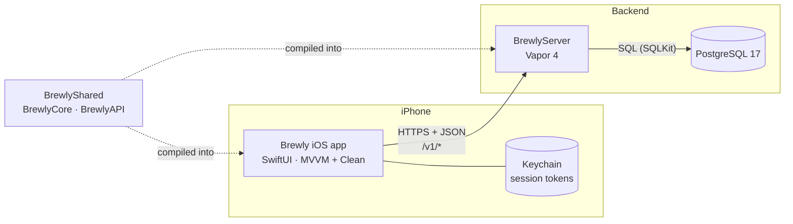
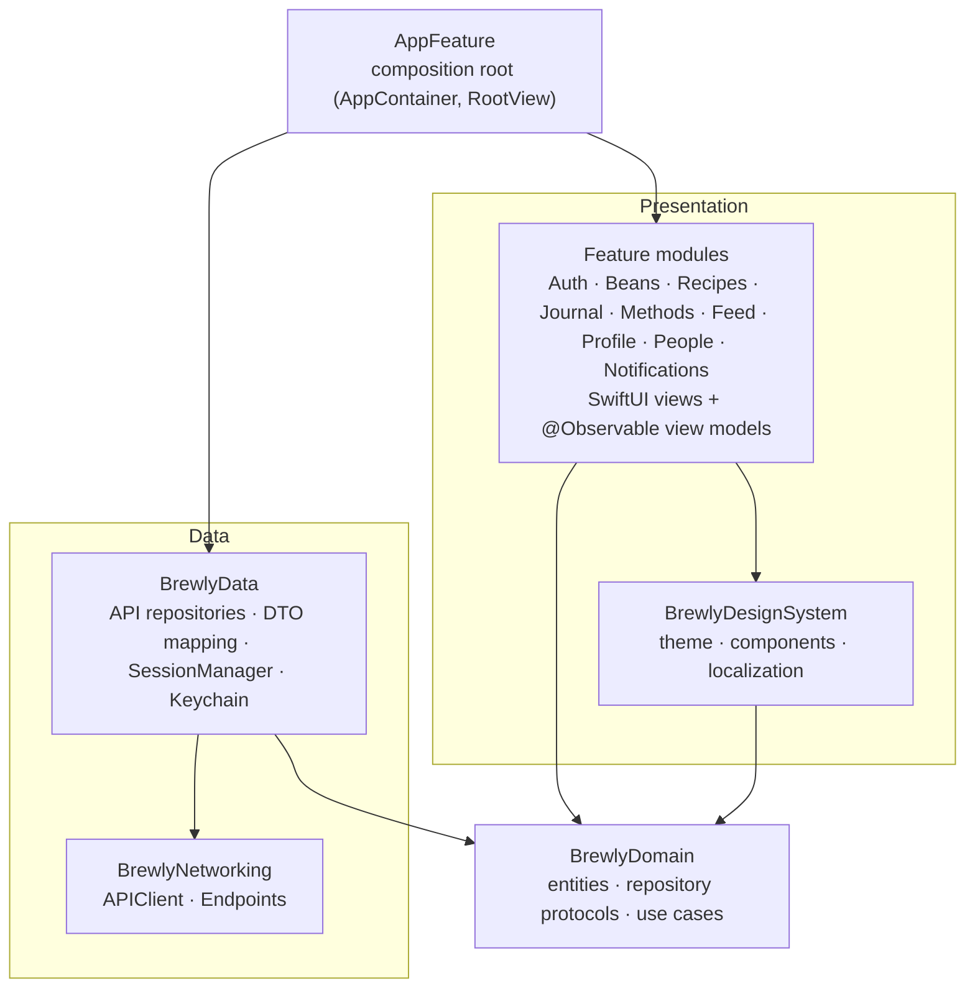
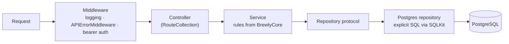
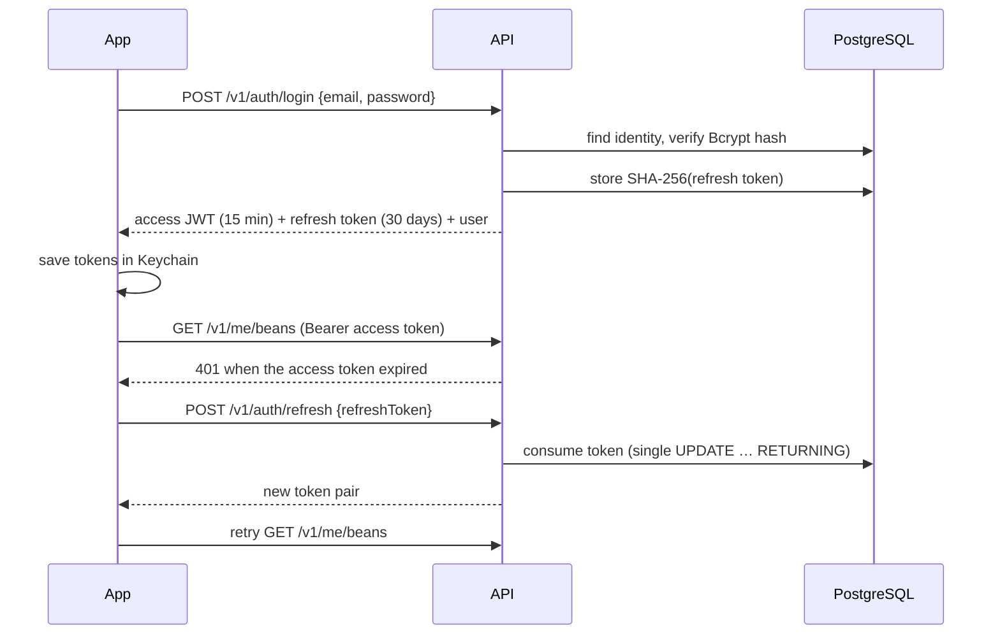

# Architecture

Brewly is a Swift full-stack monorepo: a native iOS app, a Vapor API and a PostgreSQL
database, with a shared Swift package that both the app and the server compile.

## System overview

| Component | Responsibility |
|---|---|
| **iOS app** (`ios/`) | UI, local validation, session storage, caching of catalogs. |
| **BrewlyServer** (`server/`) | Authentication, authorization (ownership and visibility), business rules, persistence. |
| **BrewlyShared** (`shared/`) | `BrewlyCore`: enums mirroring the database, brewing math, validation rules. `BrewlyAPI`: request/response DTOs. |
| **PostgreSQL** (`database/`) | Source of truth. Integrity is enforced with foreign keys, CHECK constraints, domains and generated columns. |

Because the app and the server compile the same `BrewlyCore` rules, a form in the app and the
API reject exactly the same input, and the ratio shown while typing is computed with the same
formula as the database's generated column.

## Domain model in one paragraph

A **user** owns **coffee beans** (one bag each: farm, altitude, varietals, process, roast…).
**Brew methods**, varietals, processes, countries, grinders and flavor notes are **global
catalogs** shared by everyone; each user marks the methods they use. A **recipe** is a
preparation: it uses one of the author's beans and a brew method, and stores dose, water or
beverage weight, the generated **ratio**, grind (size, grinder, setting, microns), temperature,
bloom, total time, pressure, filter, water, ordered **steps** and results (TDS, generated
**extraction yield**, rating, tasting notes). **Posts** share text, a recipe or a bean; people
follow, like, comment, block and report. See [database.md](database.md).

## iOS app

All code lives in the local Swift package `ios/BrewlyKit`; the Xcode target generated by
XcodeGen (`ios/project.yml`) only contains `BrewlyApp.swift` and assets.

- **Dependency rule.** Features know only `BrewlyDomain` and `BrewlyDesignSystem`. They receive
  repository protocols and use cases through a `…Dependencies` struct built by `AppContainer`, so
  every view model can be tested with fakes.
- **Navigation between features.** Features never import each other. A screen links to another
  feature's screen with an `AppRoute` (`.member(id)`, `.recipe(id)`, `.followers(of:)`…) defined in
  `BrewlyDesignSystem`; `AppFeature` decides which view each route opens and injects it through the
  environment, and every tab's `NavigationStack` registers it with `.appRouteDestinations()`.
- **View models** are `@MainActor @Observable` classes; screens render a `LoadState` with
  `AsyncContentView`.
- **Use cases** exist where there are rules (`SaveRecipeUseCase`, `SaveBeanUseCase`,
  `SignInUseCase`, `SignUpUseCase`); simple reads call repositories directly.
- **Networking.** `APIClient` sends typed `Endpoint<Response>` values with async/await. On a 401
  it asks `SessionManager` (an actor) for a new access token and retries once; concurrent
  refreshes share a single request.
- **Appearance.** Every color in `BrewlyDesignSystem` has a light and a dark value. The app
  follows the device setting by default; Profile → Appearance lets the user force light or dark.
  The choice is stored per device (`@AppStorage`) and applied to the app's windows, so sheets and
  alerts follow it too.
- **Images.** Photos are resized to 1600 px JPEG in `BrewlyData` before upload. Views show them
  with `RemoteImage`, which loads through an `ImageLoader` from the environment (the API client
  adds the access token) and keeps them in memory.
- **Localization.** English is the development language and every module ships a String Catalog
  with Spanish translations. Catalog items arrive from the API with canonical English names and
  are translated by `BrewlyDesignSystem`; countries are localized from their ISO code.

## Server

- One folder per feature (`Features/Auth`, `Users`, `Catalog`, `Beans`, `Recipes`, `People`,
  `Media`, `Posts`, `Notifications`).
- **SQL-first.** The schema is owned by the migrations in `database/`; Fluent is used only for
  configuration and connection pooling (no Fluent models or migrations). Repositories write
  explicit SQL so PostgreSQL features (generated columns, composite keys, the
  `can_view_content` function) are used directly.
- **Errors.** Services throw `AppError` values with stable codes; `APIErrorMiddleware` renders
  every error, including PostgreSQL constraint violations, as `APIErrorResponse` JSON.
- **Pagination** is keyset-based on `(created_at, id)` with an opaque cursor.

### Authentication

Email and password today (Bcrypt), Sign in with Apple next (`auth_identities` already supports
it, including the Apple refresh token needed to revoke it on account deletion). Sign-up asks for
first and last name, birth date (13 or older) and acceptance of the terms; accounts without them
(`needsOnboarding`) see `OnboardingView` before the app. Access tokens are short-lived JWTs; refresh tokens are opaque, stored hashed and rotated on
every use. Reusing a consumed refresh token revokes all of the user's sessions.

## Deployment (proposed)

- **API:** the multi-stage `server/Dockerfile` produces a small Ubuntu image; any container
  platform works (Fly.io, Render, Railway, AWS ECS…).
- **Database:** managed PostgreSQL 17 (Neon, RDS, Cloud SQL…); run `dbmate up` on every deploy
  before starting the new API version.
- **Configuration:** `DATABASE_URL`, `JWT_SECRET` (at least 32 characters) and optional token TTLs.
- **Media:** images are stored in PostgreSQL and served by the API at `/v1/media/{id}`
  ([ADR 0006](adr/0006-media-in-postgresql.md)); moving them to S3-compatible storage later only
  changes the server.

## Roadmap

1. **Now: architecture and skeleton.** Schema, shared package, API for auth, catalogs, beans and
   recipes, and the iOS app with navigation and bean/recipe screens.
2. **Social:** profiles of other users, follow, saving and remixing (forking) recipes, feed
   (followed users + explore), posts with photos, likes, comments and in-app notifications
   *(done)*. Next: push notifications with APNs (a `device_tokens` table and a sender called
   from `NotificationWriter`, which already runs for every notification).
3. **Brew journal:** personal details, members' equipment with the usual grind setting per
   method, and a journal of every cup (real parameters, tasting scores, notes, photo) that
   consumes the bean's remaining coffee *(in progress)*. The app's tabs are Home, Recipes,
   Journal, Beans and Profile; brew methods moved into the profile.
4. **Trust and safety:** report and block in the UI (App Store Guideline 1.2), moderation queue.
5. **More:** Sign in with Apple, search (`pg_trgm`), guided brew timer that plays recipe steps,
   offline cache, more languages.
