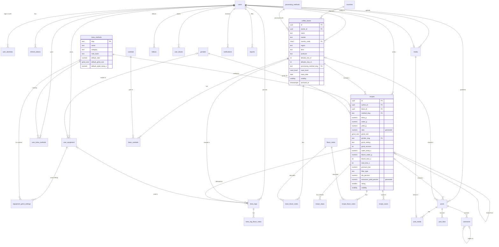

# Database

PostgreSQL is the source of truth. The schema is written in plain SQL and versioned with
[dbmate](https://github.com/amacneil/dbmate) in [`database/migrations`](../database/migrations).
It targets PostgreSQL 17 and is tested on 16 and 17.

## Entity-relationship diagram



## Tables

| Migration | Tables | Purpose |
|---|---|---|
| `foundation` | — | `set_updated_at()` trigger function; domains `visibility`, `roast_level`, `grind_size`. |
| `users_auth` | `users`, `auth_identities`, `refresh_tokens` | Profiles, sign-in methods (`password`, `apple`), hashed rotating refresh tokens. |
| `catalogs` | `countries`, `varietals`, `processing_methods`, `brew_methods`, `grinders`, `flavor_notes` | Global reference data shared by every user. |
| `catalog_seed` | — | ~46 countries, ~37 varietals, 20 processes, 18 brew methods, 20 grinders, 51 flavor notes. |
| `coffee_beans` | `coffee_beans`, `bean_varietals`, `bean_flavor_notes` | The user's beans; blends have several varietals. |
| `recipes` | `recipes`, `recipe_steps`, `recipe_flavor_notes`, `recipe_saves`, `user_brew_methods` | Recipes (preparations), pour schedule, perceived notes, bookmarks, the user's methods. |
| `social` | `follows`, `user_blocks`, `posts`, `post_media`, `post_likes`, `comments` | Social graph and feed content; `can_view_content()` function. |
| `notifications_moderation` | `notifications`, `reports` | Activity notifications and reports of objectionable content. |
| `media` | `media` (and changes to `post_media`, `posts`, `users`) | Uploaded JPEG images stored as `bytea`; post photos and avatars reference them. |
| `notification_delivery` | — | Deduplication and pagination indexes for `notifications`. |
| `profile_details` | — (changes to `users`, `auth_identities`) | Private details (first and last name, birth date), country and city, role, onboarding and activity timestamps; Sign in with Apple fields. |
| `user_equipment` | `user_equipment`, `equipment_grind_settings` | Members' gear (grinders, brewers, kettles, scales, espresso machines) and each grinder's usual setting per brew method. |
| `brew_journal` | `brew_logs`, `brew_log_flavor_notes` (and `coffee_beans.remaining_g`) | The brew journal: each cup with its real parameters, tasting scores (1–5), notes and photo; how much coffee is left in each bag. |

## Integrity rules

- **Ownership through composite foreign keys.**
  `recipes (bean_id, author_id) → coffee_beans (id, owner_id)` guarantees that a recipe only uses
  a bean of its own author. Posts use the same technique for the recipe or bean they share, and
  replies reference `(parent_id, post_id)` so they always belong to the parent's post.
- **Generated columns.** `recipes.ratio = coalesce(water_g, yield_g) / dose_g` (brew water for
  filter methods, beverage weight for espresso) and
  `recipes.extraction_yield_percent = yield_g × tds_percent / dose_g`. They can't drift from
  their inputs and can be filtered and sorted in SQL. `BrewMath` in `BrewlyCore` mirrors them.
- **Ratio basis.** `brew_methods.ratio_basis` says whether a method expresses its ratio by brew
  water (`water`) or by beverage weight (`beverage`, espresso). `RecipeRules` enforces it: filter
  recipes need `water_g`; espresso recipes need `yield_g` and reject `water_g`.
- **Ranges** are CHECK constraints: dose 0.1–1000 g, ratio 1:0.5–1:50, temperature 0–100 °C,
  altitude 0–3500 m with min ≤ max, bloom water ≤ brew water, TDS ≤ 25 %, rating 1–5, total
  time up to 48 h (cold brew), and so on. `BrewlyCore` mirrors each limit for friendly errors.
- **Deleting.** A bean used by a recipe can't be deleted (`NO ACTION`), but it can be archived
  (`archived_at`). Deleting a user removes everything they own in a single statement, as the
  App Store requires in-app account deletion. Catalog rows in use can't be deleted, and slug
  changes cascade.
- **Visibility.** `can_view_content(viewer, owner, visibility)` is the single place that decides
  whether someone can see content: owners always can; blocks hide everything in both directions;
  otherwise `public` is visible to everyone and `followers` only to followers.
- **Catalog keys.** Catalogs use stable slugs (`v60`, `washed`, `geisha`) or ISO codes as primary
  keys, so references are identical in every environment and readable in queries.

- **Counts are computed when read.** Follower, save, remix and recipe counts are `count(*)`
  subqueries over indexed keys (for example the `follows` primary key and
  `recipe_saves_recipe_idx`), so there are no counter columns to keep in sync.
- **Images.** `media` stores JPEG bytes (at most 2 MB and 4096 × 4096 px) with the uploader as
  owner. Each image is in at most one post (`post_media.media_id` is unique) or used as an
  avatar; `users.avatar_url` is generated from `avatar_media_id`, so it always points to
  `/v1/media/{id}`. Deleting a post deletes its images, and uploads that are never used are
  deleted after a day. See [ADR 0006](adr/0006-media-in-postgresql.md).
- **Notifications** are written by the API in the same transaction as the action.
  `notifications_once_idx` makes follows, likes and saves notify once per actor and target, and
  `notifications_kind_target` checks that each kind points to the right post, comment or recipe.
- **Personal details.** `users.first_name`, `last_name` and `birth_date` are private (only
  `/v1/me` returns them). They are nullable because Sign in with Apple may not provide them, but
  `users_onboarding_complete` requires them, plus `terms_accepted_at`, once
  `onboarding_completed_at` is set. The minimum age (13) depends on today's date, so
  `AccountRules` enforces it instead of a CHECK. `country_code` is any ISO 3166-1 alpha-2 code
  (not a coffee origin from `countries`) and `city` is optional.
- **Sign in with Apple.** `auth_identities.provider_refresh_token` (encrypted by the API) and
  `provider_email` are only allowed on `apple` identities; the token is needed to revoke the
  authorization when the account is deleted.
- **Equipment.** A `grinder` item can name a catalog grinder (`grinder_slug`); anything else
  needs a brand, model or nickname (`user_equipment_named`). `user_equipment_one_default_idx`
  allows one default item per kind, and the API clears the previous default in the same
  transaction. `equipment_grind_settings` keeps a grinder's usual setting per brew method (the
  API only accepts them on grinders); the default grinder and that setting pre-fill new recipes.
- **Brew journal.** `brew_logs` reuses the recipe limits and generated `ratio` and
  `extraction_yield_percent`. Composite foreign keys keep the bean and equipment the member's
  own; deleting the equipment keeps the brew (`ON DELETE SET NULL (equipment_id)`), deleting the
  followed recipe keeps it too, and a bean with brews can't be deleted (archive it). Brews are
  `private` by default. The API subtracts each brew's dose from `coffee_beans.remaining_g` in the
  same transaction, and gives it back when the brew is edited or deleted. A brew photo is
  exclusive: it can't also be a post photo or an avatar.
- **Remixes.** `recipes.forked_from_id` points to the original recipe and becomes `NULL` when the
  original is deleted, so a remix survives its original.

## Conventions

- Tables are plural `snake_case`; columns carry units (`dose_g`, `water_temp_c`, `bloom_time_s`).
- User data uses `uuid` keys (`gen_random_uuid()`); every table with `updated_at` has the
  `set_updated_at` trigger.
- Every foreign key used in joins or cascades has an index.
- Enumerations use DOMAINs or CHECK constraints instead of `ENUM` types, which are easier to
  evolve. Their values are mirrored by the Swift enums in `BrewlyCore`.

## Working with migrations

```bash
make db-up                 # PostgreSQL + migrations (docker compose)
dbmate new add_recipe_tags # creates database/migrations/<timestamp>_add_recipe_tags.sql
make db-migrate            # apply pending migrations
make db-rollback           # roll back the latest one
make db-test               # run database/tests
make db-seed               # demo data (development only)
```

Each SQL test file runs inside a transaction that is rolled back, using the helpers in
`database/tests/_helpers.sql` (`expect_error`, `expect_equal`). CI applies every migration, runs
the tests, rolls everything back, migrates again and loads the development seed.
